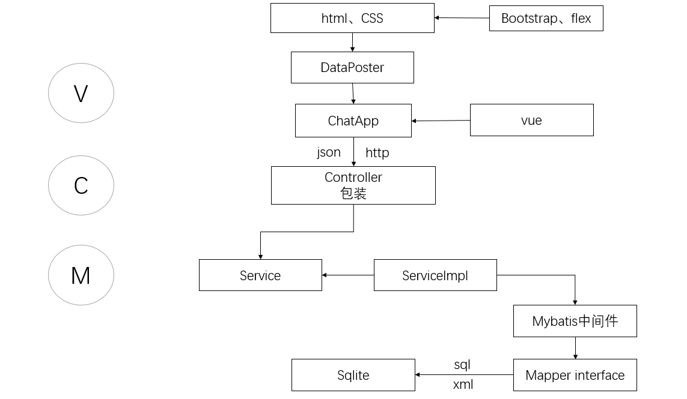

# 趣聊 

趣聊是一款由Java开发的实时Web聊天室。前端由HTML、CSS、JavaScript完成，后端由Java完成。

## 开发环境
- Visual Studio Code
- IntelliJ IDEA
- Node.js
- Chrome

## 功能描述
* 用户注册、登录、找回密码
* 聊天室消息即时推送
* 支持查找、添加好友，撤回好友申请
* 创建好友聊天
* 与聊天机器人进行聊天

## 项目结构

### 关键技术
- 前端页面使用flex框架布局
- 前端页面使用Bootstrap框架
- 前端采用轻量高效的组件化方案Vue
- 使用Ajax 实现网页异步更新
- 数据交换使用JSON格式
- 后台使用SSM框架
- 使用Maven进行依赖管理
- 后台使用SQLite轻量级数据库

## 运行程序
- 下载源文件，打开run.bat
- 打开浏览器 输入网址：localhost：80
- 进入登录界面
- 测试用户登陆账号格式为：

```
username: username
password: password
```
* 其中username是手机号，十一位数字并且以手机号常用号开头，如188、151、133等。

- 没有账号可以选择注册

- 忘记密码可以找回密码

- 登录成功进入聊天室界面，即可选择对好友的操作（查询添加好友，撤回好友申请等），也可以创建聊天。


## Debug

- 当遇到消息并没有实时推送的情况时，先F12查看浏览器的Js文件加载情况。

## 作者列表
- 宋洋、付姣姣、张珊珊、唐雪飞

**如果觉得好，请给项目点颗星来支持吧～～** 

有什么好的建议，请在issue中提出，欢迎contributors！

