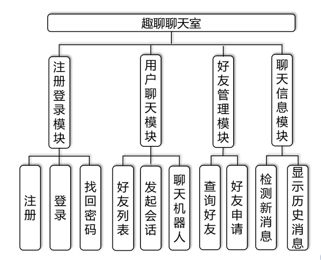
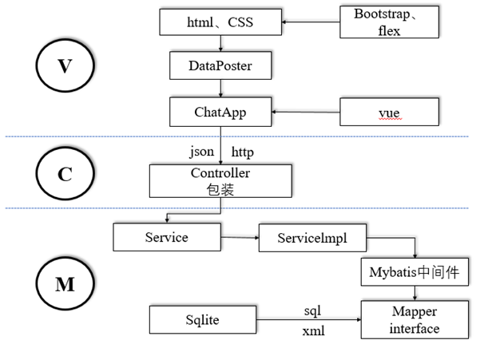
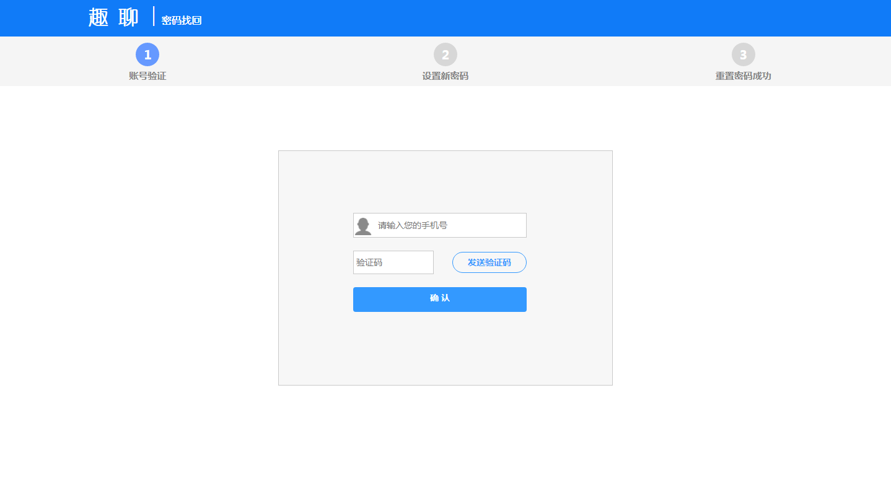
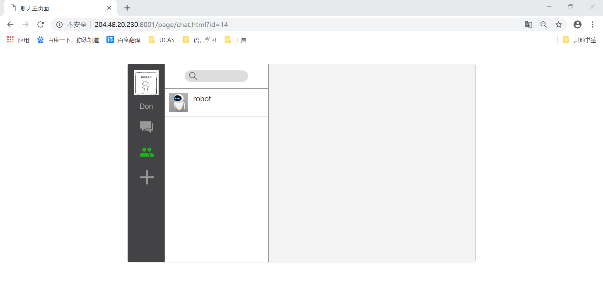
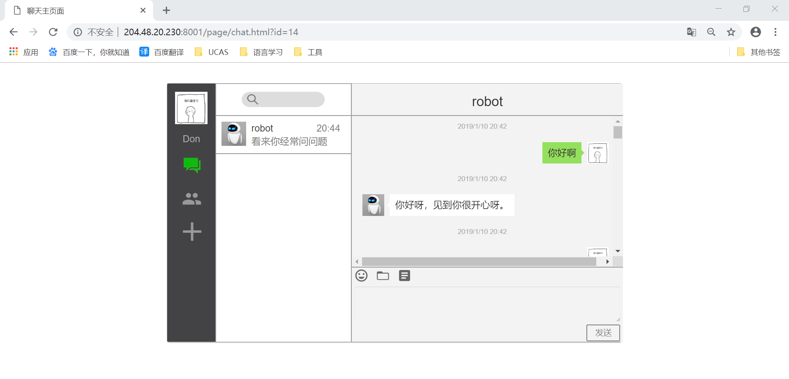

# 趣聊 

趣聊是一款由Java开发的实时Web聊天室。前端由HTML、CSS、JavaScript完成，后端由Java完成。

## 开发环境
- Visual Studio Code
- IntelliJ IDEA
- Node.js
- Chrome


## 功能描述
* 用户注册、登录、找回密码
* 聊天室消息即时推送
* 支持查找、添加好友
* 创建好友聊天，可与聊天机器人进行聊天
* 检测信息，显示聊天历史信息


## 项目结构

- 此项目采用MVC架构进行开发，将程序分成相对独立，而又能协同工作的三个部分。
- 视图部分采用HTML、CSS制作静态界面，使用Bootstrap和flex框架进行渲染
- 前端数据通过JavaScript文件DataPoster传给ChatApp，过程中用到了vue框架。
- ChatApp文件通过json、http将数据传给后台控制器Controller
- 后台模型结构如上图，用户数据存储在轻量级数据库SQLite中，接口通过sql和xml进行调用，再通过Mybatis中间件提供给服务。
### 关键技术
- 前端页面使用flex框架布局
- 前端页面使用Bootstrap框架
- 前端采用轻量高效的组件化方案Vue
- 使用Ajax 实现网页异步更新
- 数据交换使用JSON格式
- 后台使用SSM框架
- 使用Maven进行依赖管理
- 后台使用SQLite轻量级数据库

## 运行程序
- 在浏览器中打开如下链接
```
    http://204.48.20.230:8001/page/register_login.html
```

## 使用趣聊
### 登录注册
- 进入到登录界面
- 新用户可以选择注册账号

- 注册成功后可以选择登录

- 忘记密码可以找回密码，通过输入手机号获取验证码，如正确则可以重置密码。

- 登录成功进入聊天室界面，新用户只有聊天机器人一个好友。


### 聊天主界面的使用
- 点击左侧三个菜单切换 “聊天列表”、“好友列表”、“申请列表”
- 点击做下搜索框进入搜索页面，输入关键字自动匹配人员
    - 选中需要加好友的人员，发送好友申请
    - 发送好友申请后，会添加在等待回应中 
    - 等待回应中可以撤销添加好友
    - 对方登录后可以接受好友请求和拒绝请求
- 申请列表中，有其他好友发来的好友请求，可以拒绝或接受
    - 拒绝会删除该好友请求
    - 接受会通过好友请求，并将好友放置在好友列表
- 好友列表可以点击某好友进入对话模式
    - 对话模式中，可以编辑某句话然后点击“发送”或者按下回车键进行发送
    - 可以跟聊天机器人进行对话



## Debug

- 当遇到消息并没有实时推送的情况时，先F12查看浏览器的Js文件加载情况。

## 作者列表
- 宋洋、付姣姣、张珊珊、唐雪飞

**如果觉得好，请给项目点颗星来支持吧～～** 

有什么好的建议，请在issue中提出，欢迎contributors！

